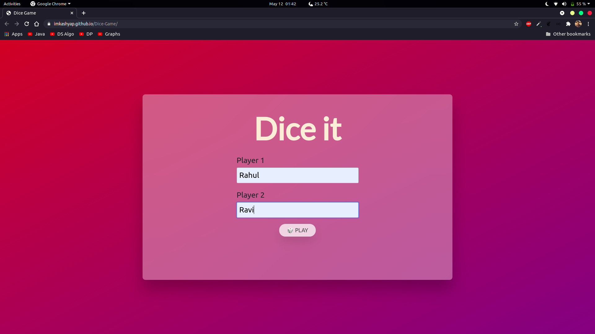
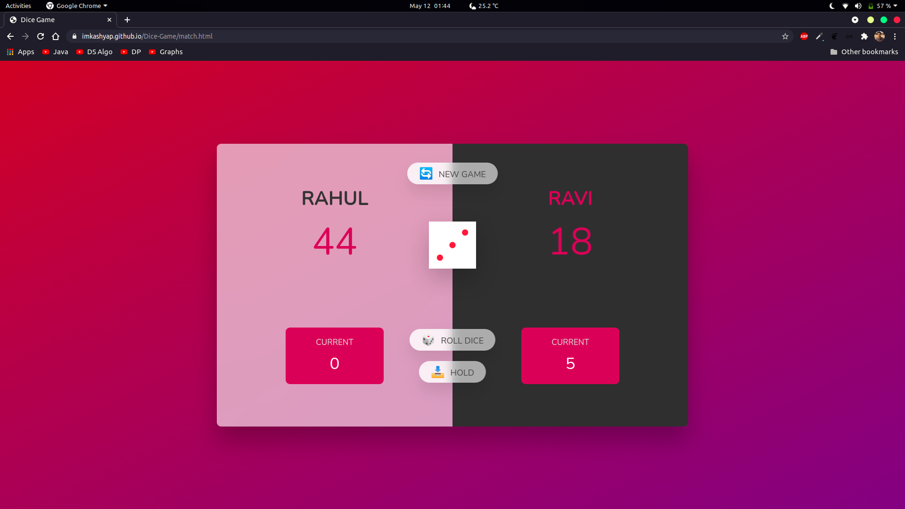

<h1 style="text-align:center;">Dice It 🎲</h1>
  
  [](https://opensource.org/licenses/MIT)

- **Dice It** is a 2 player game with following rules:
  - A player continues to roll the dice until he decides to hold or he scores **1**.
  - While the player rolls dice everytime, the total score for current round increments with dice value.
  - If scored 1 , the player not only get switched. But the round score for the 1 scoring player is considered 0. To avoid such scenario, a player can hold to save the current round score.
  - The first player to reach a score of 100 wins the match
- The app is developed in HTML, CSS & Javascript. Bootstrap is used as a framework for CSS.
- - This porject is a part of Javascript course on Udemy by *Jonas Schmedtmann*.
- Try the game [here.](https://imkashyap.github.io/Dice-Game/)
  

  ***


## Table of Contents
- [Table of Contents](#table-of-contents)
- [Features](#features)
- [Screenshots](#screenshots)
- [Getting Started](#getting-started)
- [License](#license)

***

## Features
Following features have been implemented:

- [x] Input names of players
- [x] Beautiful UI & UX Designs
- [x] Play any no. of matches without fail
- [x] Restart game at any point

***

## Screenshots
|Screen Name | Screenshots |
|---|--|
|Landing Page||
|Match Page||

***

## Getting Started
Clone the repository on your local machine.

```bash
git clone git@github.com:imKashyap/dice-game.git
```

Run `index.html` file on a live server or any browser and make sure you see the following screen:


## License
 This repository is licensed under [MIT.](https://github.com/imKashyap/dice-game/blob/main/LICENSE)
 
 Do fork and star :star: the repo if you find it appreciable.
